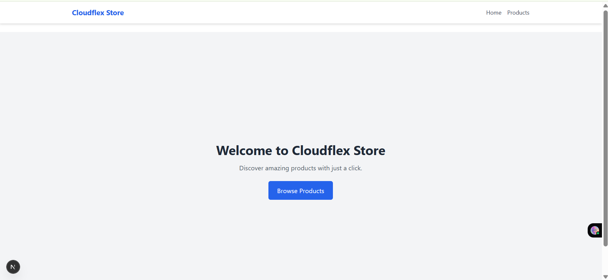
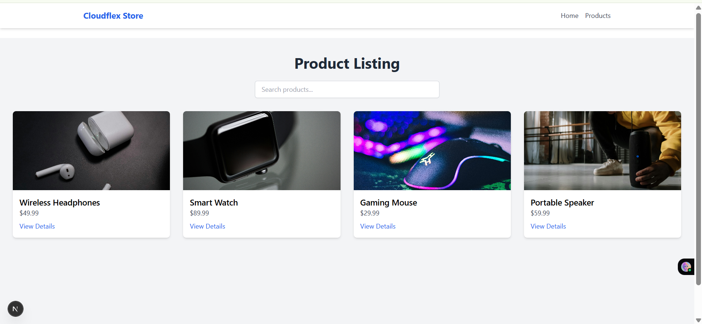
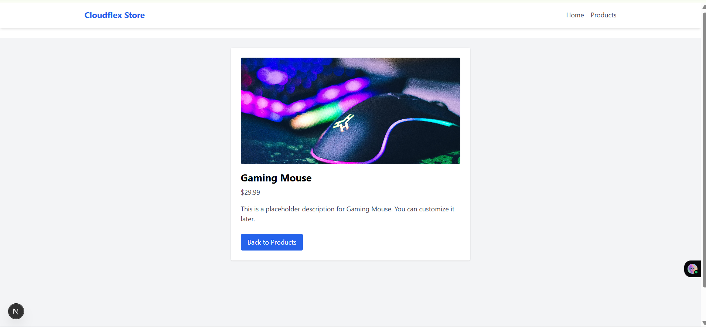
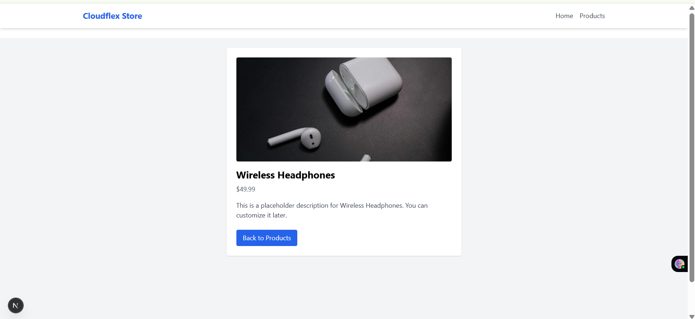

# Product Listing Interface

A responsive and clean product listing interface built using **Next.js**, **React**, and **Tailwind CSS** — developed as part of a frontend development project for showcasing modern UI design and functionality.

---

## Tech Stack

- **Next.js** – React framework with built-in routing and server-side rendering
- **React.js** – Component-based UI library
- **Tailwind CSS** – Utility-first CSS framework for fast and responsive styling
- **PostCSS** – CSS transformation tool (used under the hood with Tailwind)

---

## Features

-  Responsive **product grid** using Tailwind's utility classes
-  Individual **product detail page**: `/products/[id]`
-  **Hover effects** and smooth **transitions**
-  Fully **component-based structure**
-  **Local dummy data** (no API required)
-  Tailwind-configured layout using `globals.css` and `tailwind.config.js`
-  Mobile-first layout with grid on desktop/tablet, stacked cards on mobile

---

## Project Structure

Product_Listing_Assignment_Abhyanand_Jha/
├── components/
│   └── Navbar.js                 # Top navigation bar (optional but recommended)
├── data/
│   └── products.js               # Local dummy product data array
├── pages/
│   ├── index.js                  # Home page ("/")
│   ├── _app.js                   # Global Tailwind import and layout wrapper
│   └── products/
│       ├── index.js              # Product listing page ("/products")
│       └── [id].js               # Dynamic product detail page ("/products/[id]")
├── public/
│   └── images/
│       ├── product1.jpg
│       ├── product2.jpg
│       ├── product3.jpg
│       └── product4.jpg
├── styles/
│   └── globals.css               # Tailwind CSS base styles
├── tailwind.config.js           # Tailwind configuration
├── postcss.config.js            # PostCSS plugins (Tailwind + Autoprefixer)
├── package.json                 # Project metadata & scripts
├── README.md                    # Project documentation
└── next.config.js               # Optional: Next.js custom config 

## Setup Instructions

1. Clone the repo:
```bash
git clone https://github.com/abhijha910/Product_Listing_Assignment_Abhyanand_Jha
cd Product_Listing_Assignment_Abhyanand_Jha
```

2. Install dependencies:
```bash
npm install
```

3. Run the development server:
```bash
npm run dev
```

Then open [http://localhost:3000/products](http://localhost:3000/products) to view it.

---

## Screenshots

### Home Page


### Product Listing


### Product Details - 1


### Product Details - 2



Created by **Abhyanand Jha**
